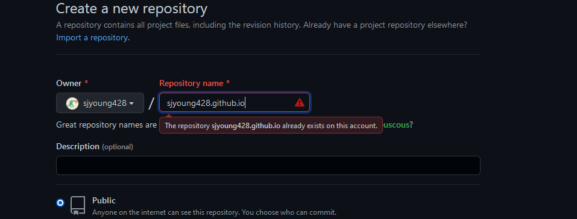
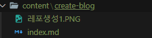
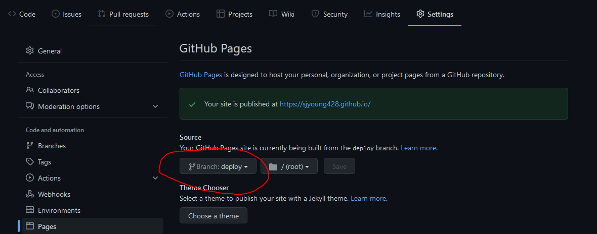

## 1. Gatsby로 개인 블로그를 만들게 된 이유

이제까지 코딩을 할 때 깃허브에 커밋을 하며 관리해왔지만 이것만으로는 코딩을 할 당시에 왜
저렇게 코드를 짰는지 어떤 에러를 만나고 어떻게 해결했는지 등을 기억해내가 힘들었기 때문에
개인 블로그가 필요하겠다고 생각했습니다.

그렇게 개인 블로그를 만드는 방법을 알아보던 중 Jekyll 또는 Gatsby로 만드는 두가지 대표적인 방법이 있다는
것을 알게 되었습니다.

이 중 Gatsby를 선택하게 된 이유는 Jekyll은 Ruby를 기반으로 만들어 졌고 Gatsby는 React기반으로 만들어졌기 때문에  
React를 주력으로 웹 개발을 하고 싶은 입장에서 Gatsby를 선택하는 것은 자연스러운 것이었습니다.

## 2. Gatsby로 블로그 만드는 방법

### Gatsby 설치

```bash
npm install -g gatsby-cli
```

### Gatsby 프로젝트 생성

```bash
gatsby new "프로젝트 이름" "적용할 테마의 주소"
```

저의 경우 zoomkoding님의 [zoomkoding-gatsby-blog](https://github.com/zoomKoding/zoomkoding-gatsby-blog) 테마를 이용했기 때문에

```bash
gatsby new "blog" "https://github.com/zoomKoding/zoomkoding.com"
```

이런식으로 했습니다.

## 3. Github에 Repository 생성


Repository 이름은 `계정이름.github.io` 이런식으로 해줍니다.

### 프로젝트와 Repository연결

```bash
git remote add origin https://github.com/sjyoung428/sjyoung428.github.io
git branch -M main
git push -u origin main
```

## 4. 로컬에서 실행하기

```bash
npm start
```

저는 이 과정에서 에러가 나서 확인해보니 `@emotion/react`가 설치 되어있지 않았습니다.

```bash
npm i @emotion/react
npm i @emotion/styled
```

이렇게 해서 해결했습니다.

## 5. Gatsby blog 커스텀하기

이 과정은 테마마다 개발 방식이 다르기 때문에 알아보시고 하셔야합니다.

### 정보 변경

`gatsby-meta-config.js`파일에 있는 여러 정보들을 변경해줍니다.

```json
author: {
    name: ``,
    bio: {
      role: `웹 개발자를 꿈꾸는`,
      description: ['사람에 가치를 두고', '능동적으로 일하고', '이로운 것을 만들고'],
      thumbnail: 'dino.jpeg',
    },
    social: {
      github: `https://github.com/sjyoung428`,
      linkedIn: ``,
      email: `sjy8267@naver.com`,
    },
  },
```

이 부분에서 변경사항이 있을 경우

```bash
npm start
```

를 다시 해주셔야 합니다.

### 포스팅 하기



본격적으로 블로그에 글을 쓰려면 /content 아래에 디렉토리를 생성하고 index.md에 markdown으로 작성하시면 됩니다.

이 때, 폴더의 이름은 경로를 생성하는데 됩니다.

이 외 여러 변경 사항에 관한 것은 [zoomkoding-gatsby-blog](https://github.com/zoomKoding/zoomkoding-gatsby-blog)에서
알아 보시는 것을 추천드립니다.

## 6. Github-Pages로 배포하기

### gh-pages 설치

```bash
npm i gh-pages
```

deploy 브랜치로 배포하기 위해 deploy 브랜치를 만들어 줍니다.

```bash
git branch deploy
```

<br/>



Repository => Settings => Pages에서 Branch를 deploy로 변경해줍니다.

<br/>
<br/>

`package.json`안에 deploy를 위한 script를 추가해줍니다.

```json
scripts:{
    "deploy": "gatsby build && gh-pages -d public -b deploy"
}
```

이제 아래 명령어를 통해 배포를 하면 됩니다.

```bash
npm run deploy
```
